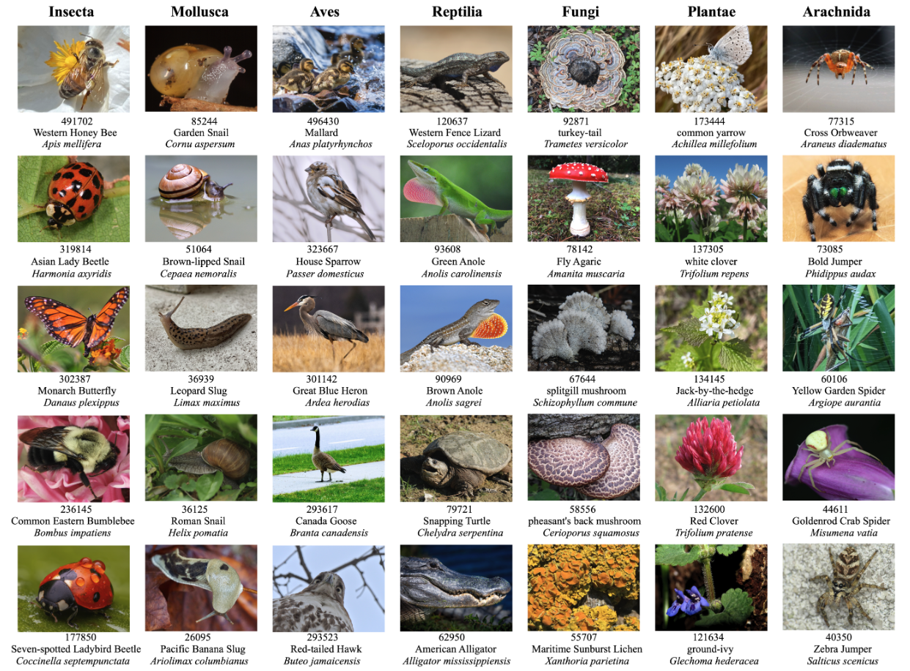

# Arboretum: A Large Multimodal Dataset Enabling AI for Biodiversity

<!-- Banner links -->
<div style="text-align:center;">
  <a href="https://baskargroup.github.io/Arboretum/" target="_blank">
    
  </a>
  <a href="https://huggingface.co/datasets/ChihHsuan-Yang/Arboretum" target="_blank">
    
  </a>
  <a href="https://github.com/baskargroup/Arboretum" target="_blank">
    
  </a>
</div>



### Contents
- [Arboretum: A Large Multimodal Dataset Enabling AI for Biodiversity](#arboretum-a-large-multimodal-dataset-enabling-ai-for-biodiversity)
    - [Contents](#contents)
  - [Data Preprocessing](#data-preprocessing)
  - [Model Training](#model-training)
  - [Model Validation](#model-validation)
    - [Pre-Run](#pre-run)
    - [Base Command](#base-command)
    - [Baseline Models](#baseline-models)
    - [Existing Benchmarks](#existing-benchmarks)
  - [Acknowledgments](#acknowledgments)
  - [Website License](#website-license)

## Data Preprocessing

**Before using this script, please download the metadata from [Hugging Face](https://huggingface.co/datasets/ChihHsuan-Yang/Arboretum)** and pre-process the data using the `arbor_process` library. The library is located in the `Arboretum/Arbor-preprocess` directory. A detailed description can be found in the [Arbor-preprocess/README](Arbor-preprocess/README_arbor_process.md) file.

The library contains scripts to generate machine learning-ready image-text pairs from the downloaded metadata in four steps:

1. *Processing metadata files* to obtain category and species distribution.
2. *Filtering metadata* based on user-defined thresholds and generating shuffled chunks.
3. *Downloading images* based on URLs in the metadata.
4. *Generating text labels* for the images.

## Model Training

We train three models using a modified version of the [BioCLIP / OpenCLIP](https://github.com/Imageomics/bioclip/tree/main/src/training) codebase. Each model is trained for 40 epochs on Arboretum-40M, on 2 nodes, 8xH100 GPUs, on NYU's [Greene](https://sites.google.com/nyu.edu/nyu-hpc/hpc-systems/greene) high-performance compute cluster.

We optimize our hyperparameters prior to training with [Ray](https://docs.ray.io/en/latest/index.html). Our standard training parameters are as follows:

```
--dataset-type webdataset 
--pretrained openai 
--text_type random 
--dataset-resampled 
--warmup 5000 
--batch-size 4096 
--accum-freq 1 
--epochs 40
--workers 8 
--model ViT-B-16 
--lr 0.0005 
--wd 0.0004 
--precision bf16 
--beta1 0.98 
--beta2 0.99 
--eps 1.0e-6 
--local-loss 
--gather-with-grad 
--ddp-static-graph 
--grad-checkpointing
```

For more extensive documentation of the training process and the significance of each hyperparameter, we recommend referencing the OpenCLIP and BioCLIP documentation, respectively.

## Model Validation

For validating the zero-shot accuracy of our trained models and comparing to other benchmarks, we use the [VLHub](https://github.com/penfever/vlhub) repository with some slight modifications.

### Pre-Run

After cloning this repository and navigating to the `Arboretum/model_validation` directory, we recommend installing all the project requirements into a conda container; `pip install -r requirements.txt`. Also, before executing a command in VLHub, please add `Arboretum/model_validation/src` to your PYTHONPATH.

```bash
export PYTHONPATH="$PYTHONPATH:$PWD/src";
```

### Base Command

A basic Arboretum model evaluation command can be launched as follows. This example would evaluate a CLIP-ResNet50 checkpoint whose weights resided at the path designated via the `--resume` flag on the ImageNet validation set, and would report the results to Weights and Biases.

```bash
python src/training/main.py --batch-size=32 --workers=8 --imagenet-val "/imagenet/val/" --model="resnet50" --zeroshot-frequency=1 --image-size=224 --resume "/PATH/TO/WEIGHTS.pth" --report-to wandb
```

### Baseline Models

We compare our trained checkpoints to three strong baselines. We describe our baselines in the table below, including the required flags to evaluate them.


| Model Name  | Origin                                       | Path to checkpoint                        | Runtime Flags                                           |
|-------------|----------------------------------------------|-------------------------------------------|---------------------------------------------------------|
| BioCLIP     | https://arxiv.org/abs/2311.18803             | https://huggingface.co/imageomics/bioclip | --model ViT-B-16 --resume "/PATH/TO/bioclip_ckpt.bin"   |
| OpenAI CLIP | https://arxiv.org/abs/2103.00020             | Downloads automatically                   | --model ViT-B-16 --pretrained=openai                    |
| MetaCLIP-cc | https://github.com/facebookresearch/MetaCLIP | Downloads automatically                   | --model ViT-L-14-quickgelu --pretrained=metaclip_fullcc |


### Existing Benchmarks

In the Arboretum paper, we report results on the following established benchmarks from prior scientific literature: [Birds525](https://www.kaggle.com/datasets/gpiosenka/100-bird-species), [BioCLIP-Rare](https://huggingface.co/datasets/imageomics/rare-species), [IP102 Insects](https://www.kaggle.com/datasets/rtlmhjbn/ip02-dataset), [Fungi](http://ptak.felk.cvut.cz/plants/DanishFungiDataset/DF20M-images.tar.gz), [Deepweeds](https://www.kaggle.com/datasets/imsparsh/deepweeds), and [Confounding Species](https://arxiv.org/abs/2306.02507). We also introduce three new benchmarks: Arboretum-Balanced, Arboretum-LifeStages, and Arboretum-Unseen.

Our package expects a valid path to each image to exist in its corresponding metadata file; therefore, **metadata CSV paths must be updated before running each benchmark.**

| Benchmark Name      | Images URL                                                             | Metadata Path                                       | Runtime Flag(s)                     |
|---------------------|------------------------------------------------------------------------|-----------------------------------------------------|-------------------------------------|
| Arboretum-Balanced  | https://huggingface.co/datasets/ChihHsuan-Yang/Arboretum               | model_validation/metadata/arboretum_test_metadata.csv | --arbor-val --taxon MY_TAXON      |
| Arboretum-Lifestages | https://huggingface.co/datasets/ChihHsuan-Yang/Arboretum              | model_validation/metadata/final_lifestages_metadata.csv | --lifestages --taxon MY_TAXON   |
| Arboretum-Rare      | https://huggingface.co/datasets/ChihHsuan-Yang/Arboretum               | model_validation/metadata/arboretum_rare_combined_metadata.csv | --arbor-rare --taxon MY_TAXON |
| BioCLIP Rare        | https://huggingface.co/datasets/imageomics/rare-species                | model_validation/metadata/bioclip-rare-metadata.csv | --bioclip-rare --taxon MY_TAXON     |
| Birds525            | https://www.kaggle.com/datasets/gpiosenka/100-bird-species             | model_validation/metadata/birds525_metadata.csv     | --birds /birds525 --ds-filter birds |
| Confounding Species | TBD                                                                    | model_validation/metadata/confounding_species.csv   | --confounding                       |
| Deepweeds           | https://www.kaggle.com/datasets/imsparsh/deepweeds                     | model_validation/metadata/deepweeds_metadata.csv    | --deepweeds                         |
| Fungi               | http://ptak.felk.cvut.cz/plants/DanishFungiDataset/DF20M-images.tar.gz | model_validation/metadata/fungi_metadata.csv        | --fungi                             |
| IP102 Insects       | https://www.kaggle.com/datasets/rtlmhjbn/ip02-dataset                  | model_validation/metadata/ins2_metadata.csv         | --insects2                          |

## Acknowledgments

If you find this repository useful, please consider citing these related papers --

VLHub

```bibtex
@article{
  feuer2023distributionally,
  title={Distributionally Robust Classification on a Data Budget},
  author={Benjamin Feuer and Ameya Joshi and Minh Pham and Chinmay Hegde},
  journal={Transactions on Machine Learning Research},
  issn={2835-8856},
  year={2023},
  url={https://openreview.net/forum?id=D5Z2E8CNsD},
  note={}
}
```

BioCLIP

```bibtex
@misc{stevens2024bioclip,
      title={BioCLIP: A Vision Foundation Model for the Tree of Life}, 
      author={Samuel Stevens and Jiaman Wu and Matthew J Thompson and Elizabeth G Campolongo and Chan Hee Song and David Edward Carlyn and Li Dong and Wasila M Dahdul and Charles Stewart and Tanya Berger-Wolf and Wei-Lun Chao and Yu Su},
      year={2024},
      eprint={2311.18803},
      archivePrefix={arXiv},
      primaryClass={cs.CV}
}
```

OpenCLIP

```bibtex
@software{ilharco_gabriel_2021_5143773,
  author       = {Ilharco, Gabriel and
                  Wortsman, Mitchell and
                  Wightman, Ross and
                  Gordon, Cade and
                  Carlini, Nicholas and
                  Taori, Rohan and
                  Dave, Achal and
                  Shankar, Vaishaal and
                  Namkoong, Hongseok and
                  Miller, John and
                  Hajishirzi, Hannaneh and
                  Farhadi, Ali and
                  Schmidt, Ludwig},
  title        = {OpenCLIP},
  month        = jul,
  year         = 2021,
  note         = {If you use this software, please cite it as below.},
  publisher    = {Zenodo},
  version      = {0.1},
  doi          = {10.5281/zenodo.5143773},
  url          = {https://doi.org/10.5281/zenodo.5143773}
}
```

Parts of this project page were adopted from the [Nerfies](https://nerfies.github.io/) page.

## Website License
<a rel="license" href="http://creativecommons.org/licenses/by-sa/4.0/"></a><br />This work is licensed under a <a rel="license" href="http://creativecommons.org/licenses/by-sa/4.0/">Creative Commons Attribution-ShareAlike 4.0 International License</a>.
